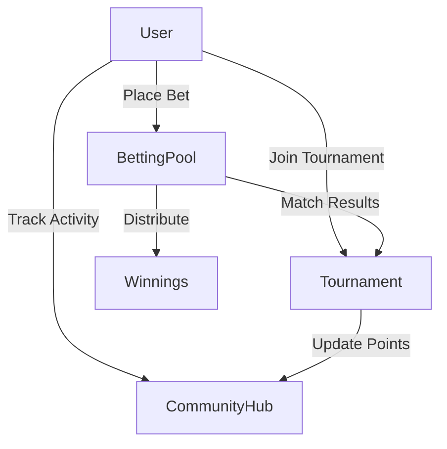

# ChainBets - Decentralized Esports Betting Platform

ChainBets is a decentralized betting platform built on Ancient8 Chain, enabling users to place bets on esports matches using WETH tokens.

## Deployed Contracts (Ancient8 Testnet)

- **BettingPool**: `0x792f1fB27F6B61f030469acdCf397c8444d6BF2B`
- **Tournament**: `0xD8f3dd02dee5a98b067c2F90062ca70A99fc15D8`
- **CommunityHub**: `0x8e65D16397142D7a3bD88f90dE7Ee85a8BC34F99`
- **WETH Token**: `0x4200000000000000000000000000000000000006`

## Features

- **Decentralized Betting**: Place bets using WETH tokens
- **Match Management**: Create and manage esports matches
- **Tournament System**: Participate in tournaments with multiple matches
- **Community Features**: Earn rewards and track activity
- **Automated Payouts**: Smart contract handles winnings distribution
- **Protocol Fee System**: Configurable fee structure (default 2.5%)
- **Emergency Controls**: Pause functionality and admin controls
- **Gas Optimized**: Built for Ancient8 Chain L2

## Smart Contracts

The platform consists of three main contracts:

### BettingPool.sol
- Core betting functionality
- Match creation and management
- Bet placement and settlement
- Winnings distribution
- Protocol fee management
- Emergency controls

### Tournament.sol
- Tournament creation and management
- Entry fee handling
- Match predictions
- Prize pool distribution
- Score tracking

### CommunityHub.sol
- Community activity tracking
- User rewards
- Platform engagement metrics

## Technical Stack

- **Framework**: Foundry
- **Language**: Solidity ^0.8.24
- **Dependencies**: OpenZeppelin Contracts
- **Chain**: Ancient8 Chain (L2)
- **Network**: Ancient8 Testnet (Chain ID: 28122024)

## Getting Started

### Prerequisites

```bash
# Install Foundry
curl -L https://foundry.paradigm.xyz | bash
foundryup

# Clone the repository
git clone https://github.com/your-username/chainbets.git
cd chainbets

# Install dependencies
forge install
```

### Build and Test

```bash
# Build
forge build

# Test
forge test -vvv
```

## Deployment

1. Create `.env` file:
```env
PRIVATE_KEY=your_private_key_here
ANCIENT8_RPC_URL=https://rpcv2-testnet.ancient8.gg
ANCIENT8_CHAIN_ID=28122024
OP_TOKEN_ADDRESS=0x4200000000000000000000000000000000000006
```

2. Deploy contracts:
```bash
forge script script/Deploy.s.sol:DeployChainBets \
    --rpc-url https://rpcv2-testnet.ancient8.gg \
    --broadcast \
    -vvvv
```

## Contract Interaction

### Create Match
```solidity
function createMatch(
    string memory name,
    uint256 startTime,
    uint256 endTime,
    uint256 minBet,
    uint256 maxBet
) external onlyOwner
```

### Place Bet
```solidity
function placeBet(
    uint256 matchId,
    uint256 amount,
    uint8 prediction
) external
```

### Join Tournament
```solidity
function joinTournament(uint256 tournamentId) external
```

### Submit Prediction
```solidity
function submitPrediction(
    uint256 tournamentId,
    uint256 matchId,
    uint8 prediction
) external
```

### Claim Winnings
```solidity
function claimWinnings(uint256 matchId) external
```

## Security Features

- **Reentrancy Protection**: OpenZeppelin's ReentrancyGuard
- **Access Control**: Role-based using Ownable
- **Safe Token Transfers**: OpenZeppelin's SafeERC20
- **Emergency Pause**: Pausable functionality
- **Gas Optimization**: Storage patterns and efficient code

## Architecture



## Testing Coverage

- Match creation and management
- Betting mechanics
- Tournament functionality
- Community features
- Winnings calculation and distribution
- Protocol fee handling
- Emergency scenarios

## License

MIT License - see LICENSE.md for details.

## Acknowledgments

- OpenZeppelin for secure contract implementations
- Ancient8 Chain for L2 infrastructure
- Foundry for development framework
