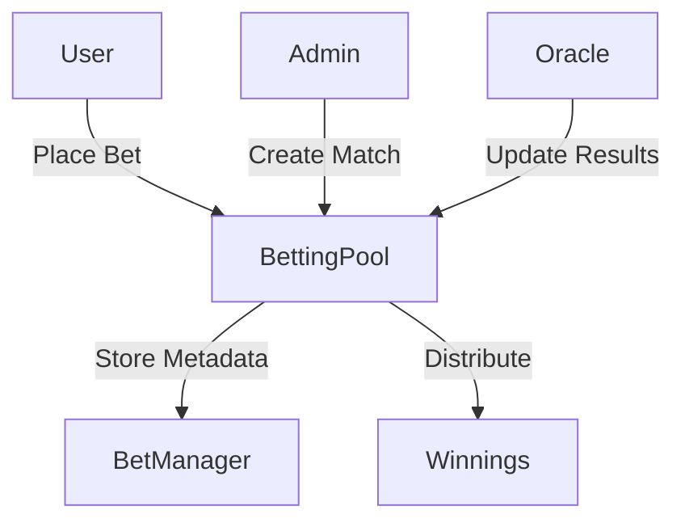

# ChainBets - Decentralized Esports Betting Platform

ChainBets is a decentralized betting platform built on Ancient8 Chain, enabling users to place bets on esports matches using A8 tokens.

## Features

- **Decentralized Betting**: Place bets using Ancient8 OP tokens
- **Match Management**: Create and manage esports matches
- **Automated Payouts**: Smart contract handles winnings distribution
- **Protocol Fee System**: Configurable fee structure (default 2.5%)
- **Emergency Controls**: Pause functionality and admin controls
- **Gas Optimized**: Built for Ancient8 Chain L2

## Smart Contracts

The platform consists of two main contracts:

### BettingPool.sol
- Core betting functionality
- Match creation and management
- Bet placement and settlement
- Winnings distribution
- Protocol fee management
- Emergency controls

### BetManager.sol
- Match metadata management
- Oracle management
- Additional match data storage

## Technical Stack

- **Framework**: Foundry
- **Language**: Solidity ^0.8.24
- **Dependencies**: OpenZeppelin Contracts
- **Chain**: Ancient8 Chain (L2)

## Getting Started

### Prerequisites

```bash
# Install Foundry
curl -L https://foundry.paradigm.xyz | bash
foundryup

# Clone the repository
git clone https://github.com/your-username/chainbets.git
cd chainbets

# Install dependencies
forge install
```

### Build

```bash
forge build
```

### Test

```bash
# Run all tests
forge test

# Run with verbosity
forge test -vvv

# Run with gas reporting
forge test --gas-report
```

## Deployment

1. Create `.env` file:
```env
PRIVATE_KEY=your_private_key_here
ANCIENT8_RPC_URL=your_ancient8_rpc_url
ANCIENT8_CHAIN_ID=2375
OP_TOKEN_ADDRESS=ancient8_op_token_address
ORACLE_ADDRESS=your_oracle_address
ETHERSCAN_API_KEY=your_etherscan_api_key
```

2. Deploy contracts:
```bash
forge script script/Deploy.s.sol:DeployChainBets \
    --rpc-url $ANCIENT8_RPC_URL \
    --broadcast \
    --verify \
    -vvvv
```

3. Verify contracts:
```bash
forge verify-contract <BETTING_POOL_ADDRESS> src/BettingPool.sol:BettingPool \
    --constructor-args $(cast abi-encode "constructor(address)" $OP_TOKEN_ADDRESS) \
    --chain-id 2375

forge verify-contract <BET_MANAGER_ADDRESS> src/BetManager.sol:BetManager \
    --constructor-args $(cast abi-encode "constructor(address)" $BETTING_POOL_ADDRESS) \
    --chain-id 2375
```

## Contract Interaction

### Create Match
```solidity
function createMatch(
    string memory name,
    uint256 startTime,
    uint256 endTime,
    uint256 minBet,
    uint256 maxBet
) external onlyOwner
```

### Place Bet
```solidity
function placeBet(
    uint256 matchId,
    uint256 amount,
    uint8 prediction
) external
```

### Claim Winnings
```solidity
function claimWinnings(uint256 matchId) external
```

## Security Features

- **Reentrancy Protection**: OpenZeppelin's ReentrancyGuard
- **Access Control**: Role-based using Ownable
- **Safe Token Transfers**: OpenZeppelin's SafeERC20
- **Emergency Pause**: Pausable functionality
- **Gas Optimization**: Storage patterns and efficient code

## Architecture



## Testing Coverage

- Match creation and management
- Betting mechanics
- Winnings calculation and distribution
- Protocol fee handling
- Emergency scenarios
- Oracle interactions

## Contributing

1. Fork the repository
2. Create your feature branch (`git checkout -b feature/amazing-feature`)
3. Commit your changes (`git commit -m 'Add amazing feature'`)
4. Push to the branch (`git push origin feature/amazing-feature`)
5. Open a Pull Request

## License

MIT License - see LICENSE.md for details

## Acknowledgments

- OpenZeppelin for secure contract implementations
- Ancient8 Chain for L2 infrastructure
- Foundry for development framework